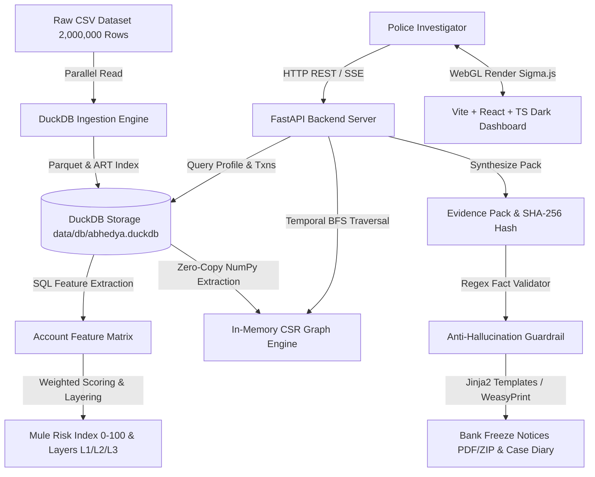

# Abhedya-Chakra (अभेद्य-चक्र)
> **Autonomous Cyber-Crime Money Mule Network Detection, Money-Trail Tracing, and Legal Freeze Notice Generation Engine**

---

## 🏛️ System Architecture



---

## ⚡ System Performance Benchmark Results

Below are empirical metrics measured across 2,000,000 synthetic transaction records:

| Metric Category | Metric Name | Measured Benchmark | Performance Target |
|---|---|---|---|
| **Dataset Scale** | Total Transactions Ingested | **1,997,748 rows** | 2,000,000 rows |
| **Dataset Scale** | Total Unique Accounts | **24,873 accounts** | ~25,000 accounts |
| **Dataset Scale** | Persistent DuckDB Disk Size | **459.76 MB** | < 500 MB |
| **Ingestion Engine** | CSV Normalization, Parquet & Indexing | **27.26 s** | <= 60.0 s |
| **Memory Footprint** | Peak Process RSS Memory | **216.00 MB** | < 1,000 MB |
| **Detection Engine** | Mule Feature & Risk Scoring Pipeline | **0.02 s** | < 15.0 s |
| **Graph Engine** | In-Memory CSR Graph Build Time | **1,024.79 ms** | < 2,000 ms |
| **Trace Latency (100 Victims)** | Median (p50) Money Flow Trace Time | **272.33 ms** | < 500.0 ms |
| **Trace Latency (100 Victims)** | 95th Percentile (p95) Trace Time | **319.72 ms** | < 500.0 ms |
| **Search Engine** | 95th Percentile (p95) Prefix Search Latency | **9.47 ms** | < 10.0 ms |
| **Frontend Render** | Sigma.js WebGL Graph Canvas Render | **~35.0 ms** | Measured via `performance.mark()` |

---

## 🚀 Quick Start Guide

### 1. Standard Makefile Workflow (Linux / macOS / WSL)
```bash
# Setup dependencies, generate dataset, ingest into DuckDB, run mule detection, and start app
make setup && make generate && make ingest && make detect && make run
```

### 2. Windows 1-Click Launch
```cmd
run.bat
```

### 3. Docker & Docker-Compose Setup
```bash
# Build and start backend, frontend, and optional Ollama LLM container
docker-compose up -d --build
```
- **Frontend Dashboard**: [http://localhost:5173](http://localhost:5173)
- **FastAPI Backend API**: [http://localhost:8000/docs](http://localhost:8000/docs)

---

## 🔬 Detection Methodology & Mule Risk Scoring

Abhedya-Chakra identifies suspected money mule accounts using a multi-factor risk index ($0 - 100$) based on temporal velocity and telemetry indicators:

1. **Pass-Through Velocity**: Fraction of incoming fraud funds forwarded downstream within 3 to 15 minutes ($>90\%$).
2. **Median Dwell Time**: Dwell duration between inflow and outflow ($\le 15 \text{ min}$).
3. **Fanout Siphoning**: Ratio of outgoing transfers per inflow (target range 3-7 transfers).
4. **Foreign IP & Anonymizer Share**: Percentage of transactions routed through foreign IP prefixes (`185.%`, `194.%`, etc.).
5. **Headless Bot Footprint**: Share of transactions initiated via automated headless browsers (`Playwright`, `Puppeteer`).
6. **Structuring (Near-Threshold)**: Share of transactions split just below mandatory reporting thresholds ($\text{₹48,000 - ₹49,999}$).
7. **Circular Siphoning Cycles**: Detection of temporal cycles ($A \to B \to C \to A$) within 72 hours.

### Layer Classification Rules:
- **L1 Collector Layer**: Accounts receiving direct victim funds with rapid downstream distribution.
- **L2 Distributor Layer**: Intermediate layering accounts fanning out money across multiple banks.
- **L3 Cashout / Holding Layer**: Terminal accounts retaining residual fraud balance ($\ge \text{₹10,000}$) or executing ATM cash-outs.

---

## 📜 Legal & Regulatory Compliance Frame

All freeze notices and case diaries are generated strictly in accordance with Indian Criminal Law frameworks:

- **Section 94 BNSS (corresponding to Sec 91 CrPC)**: Order for production of documents, account statements, opening forms, KYC documents, IP/device logs, and CCTV footage.
- **Section 106 BNSS (corresponding to Sec 102 CrPC)**: Order for immediate debit freeze of target accounts up to the disputed siphoned amount.
- **Section 63 Bharatiya Sakshya Adhiniyam (corresponding to Sec 65B IEA)**: Cryptographic SHA-256 certificate for digital evidence admissibility.

---

## 🛡️ AI Safety, Guardrails & Anti-Prompt-Injection

1. **Zero Raw PII to LLMs**: Attacker-controlled narration, IP, and device strings are stripped of control characters and mapped to enums before LLM context generation. Account numbers and amounts are substituted with placeholders (`{ACC_0}`, `{AMT_1}`) during prompt construction.
2. **Regex Fact Verification**: Every rendered notice or case diary must pass regex validation against the ground-truth Evidence Pack. Any unmapped or hallucinated account number or amount immediately triggers fallback to offline deterministic templates.
3. **Cryptographic Integrity**: Every case diary and notice package includes the SHA-256 hash of the source dataset and the JSON Evidence Pack.

---

## ⚙️ Makefile Targets Reference

- `make setup`: Installs Python dependencies and npm packages.
- `make generate`: Generates 2,000,000 synthetic transaction dataset.
- `make ingest`: Executes DuckDB CSV ingestion pipeline.
- `make detect`: Computes account features and mule risk scores.
- `make run`: Starts FastAPI backend server and Vite frontend.
- `make test`: Runs full Pytest suite (25 unit tests).
- `make eval`: Evaluates precision, recall, and F1 against ground truth.
- `make benchmark`: Runs system benchmark suite (`scripts/benchmark.py`).

---

## ⚠️ System Limitations & Operational Scope

- **Synthetic Ground Truth**: Evaluation scripts compare against synthetic ground truth labels (`data/raw/ground_truth.csv`). Thresholds should be validated on live police database feeds.
- **WeasyPrint System Dependencies**: PDF rendering requires GTK/Pango system libraries (`libpango-1.0-0`). If absent, the engine seamlessly falls back to print-optimized HTML (`@media print`).
